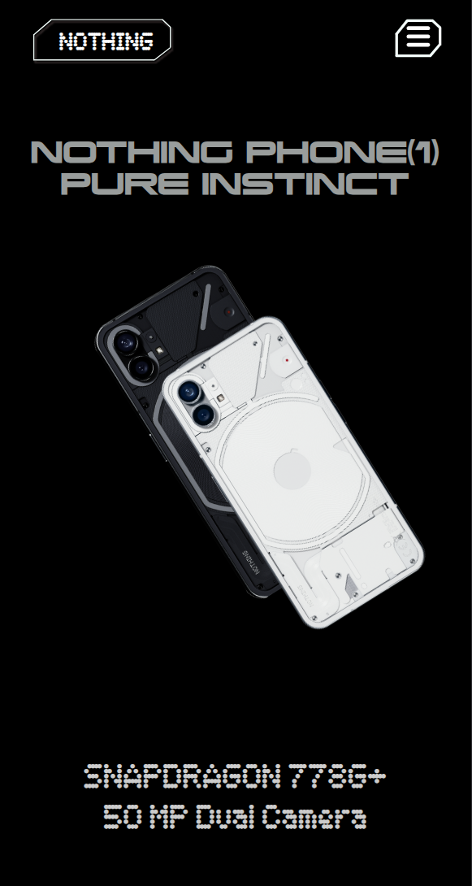
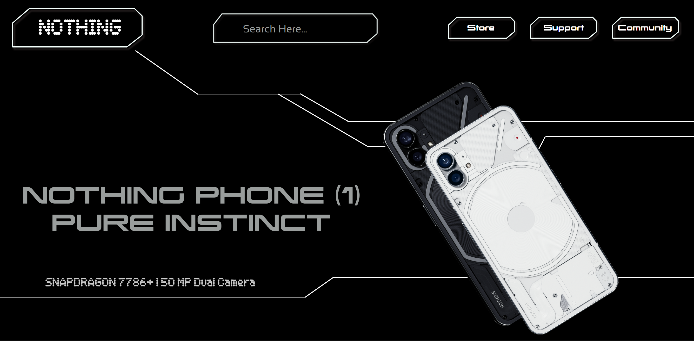

# Nothing — simple static clone

A minimal, elegant static clone inspired by the Nothing Phone (visual concept) — a tiny HTML/CSS landing layout created for practice and demonstration.

Access link: <a href="https://nothing-static-clone-arpan.netlify.app/">https://nothing-static-clone-arpan.netlify.app/</a>

## Mobile and desktop views

## Preview

Open `index.html` in your browser to view the page. The layout adapts for small screens using a responsive block (`hero-responsive`).

## Files of note

- `index.html` — the page markup.
- `css/style.css` — all styles (desktop and mobile media queries).
- `fonts/` — local font files used with `@font-face`.
- `images/` — SVGs and PNGs used for logos and phone images.

## How to run

1. Open the project folder in your editor or file explorer.
2. Double-click `index.html` or open it in your browser.